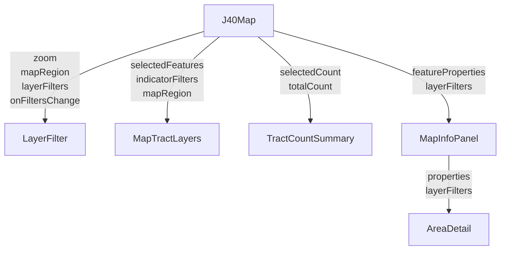

# Layer Filter and Territory-Aware Behavior

This README summarizes the new **Layers** control (LayerFilter) so users can filter tracts by “Identified as disadvantaged” or by specific burden indicators, plus **territory-aware behavior** so that when the map view is over Puerto Rico or Island Areas (e.g. Guam), the filter UI and map shading use the correct rules and tile properties for those regions.

---

## For QA / Product (General)

### What the feature is

- **Layers** is the control in the map header that lets users choose how tracts are highlighted: either the default **Identified as disadvantaged** view or one or more **burden indicators** (e.g. Climate, Energy, Workforce). The choice drives which tracts are colored on the map, the “X of Y tracts” count, and (when a tract is selected) what the side panel shows.
- When the **map view** is over a **territory** (Puerto Rico or Island Areas such as Guam), the Layers UI **disables** checkboxes for burdens that are not shown there (e.g. in Guam only Workforce-related options stay enabled), and previously selected disabled options are **auto-unchecked**. Map shading and the side panel’s “above threshold” counts use territory-specific data where applicable.

### Where to find it

- The **Layers** control is in the map header strip (next to search and geolocate). On **desktop** it opens a dropdown below the button; on **mobile** it opens a full-screen overlay.

### When it’s available

- Layers is **enabled** only when the map is zoomed in to at least level **5**. Below that, the control is disabled and shows “Zoom in to enable” (or “Zoom in to view selection” if the user had already selected burdens).

### Glossary

| Term | Meaning |
|------|---------|
| **Identified as disadvantaged** | Default view: tracts are highlighted using the same rule the tool uses to mark a tract as disadvantaged. |
| **Burden indicator** | A single metric (e.g. unemployment, asthma) or category of metrics that can be selected in Layers to highlight tracts above a threshold. |
| **Map region** | Whether the current map view is over the **nation** (lower 48, AK, HI), **Puerto Rico**, or **Island Areas** (e.g. Guam, American Samoa). Drives which Layers options are enabled. |
| **Custom view** | When the user has selected one or more burden indicators (instead of “Identified as disadvantaged” only). The side panel then shows only those indicators and an “X of Y selected burdens” summary. |
| **Territory** | Puerto Rico or Island Areas (Guam, American Samoa, Northern Mariana Islands, U.S. Virgin Islands). These use different data/indicators than the nation. |

---

## For Developers (Technical)

### Data flow (component-centric)

J40Map owns **viewport**, **layerFilters**, and **selected tract** (detailViewData). It computes **mapRegion** from viewport (zoom ≥ 5) and passes it and **layerFilters** (and callbacks) to the components below. Filter state flows **up** via `onFiltersChange`; everything else flows **down**.

- **Viewport-driven:** LayerFilter (which checkboxes are disabled) and MapTractLayers (which tile properties are used for shading) depend on **mapRegion** from the current viewport.
- **Tract-driven:** The side panel (AreaDetail) shows content based on the **selected tract’s** properties (e.g. `UI_EXP` / sidePanelState). If the user pans back to the 48 without selecting a new tract, the side panel still shows the previous (e.g. Guam) tract’s content until they click a tract in the 48.

### Subsystems

| Subsystem | Role | Location |
|-----------|------|----------|
| **LayerFilter** | Layers UI: zoom messaging, “Identified as disadvantaged” and burden checkboxes, territory-based disabling and auto-uncheck. | `client/src/components/LayerFilter/` |
| **mapRegion** | Viewport → region: `getMapRegionFromViewport(lng, lat)`, `sidePanelStateToMapRegion(sidePanelState)`. | `client/src/utils/mapRegion.ts` |
| **indicatorRegion** | Resolves threshold tile property by region: `getThresholdPropertyName(indicatorId, region)` (e.g. IA_* in Island Areas). | `client/src/utils/indicatorRegion.ts` |
| **territoryConfig** | Which indicators/categories are disabled per region: `getDisabledIndicatorIdsForRegion(region)`, `DISABLED_CATEGORY_IDS_WHEN_ISLAND_AREAS`. | `client/src/data/territoryConfig.ts` |
| **Indicator registry** | Single source of truth for indicator ids, labels, and threshold property names (including optional `thresholdPropertyNameIslandAreas`). | `client/src/data/indicators/registry.ts` |
| **MapTractLayers** | Builds map paint expression from selected indicators and **mapRegion** (via `getThresholdPropertyName`). | `client/src/components/MapTractLayers/MapTractLayers.tsx` |
| **AreaDetail** | Side panel: uses tract **properties** and **layerFilters**; X-of-Y and workforce “above threshold” use `getThresholdPropertyName` + `sidePanelStateToMapRegion`. | `client/src/components/AreaDetail/AreaDetail.tsx` |
| **TractCountSummary** | “X of Y tracts” from `getSelectedTractCount(layerFilters)`. | `client/src/components/TractCountSummary/` |
| **tractCounts** | `getSelectedTractCount(filterState)` and precomputed counts per indicator. | `client/src/data/indicators/tractCounts.ts` |

### Key files

| Path | Purpose |
|------|---------|
| `client/src/components/LayerFilter/LayerFilter.tsx` | LayerFilter component and filter state handling. |
| `client/src/components/J40Map.tsx` | Owns viewport, layerFilters, mapRegion; passes props to LayerFilter, MapTractLayers, TractCountSummary, MapInfoPanel. |
| `client/src/utils/mapRegion.ts` | MapRegion type, viewport → region, sidePanelState → region. |
| `client/src/utils/indicatorRegion.ts` | getThresholdPropertyName(indicatorId, region). |
| `client/src/data/territoryConfig.ts` | Disabled indicator/category sets per region. |
| `client/src/data/indicators/registry.ts` | Indicator definitions and optional thresholdPropertyNameIslandAreas. |
| `client/src/data/indicators/tractCounts.ts` | getSelectedTractCount, TOTAL_TRACT_COUNT. |
| `client/src/data/copy/layerFilter.tsx` | Copy for Layers UI and zoom messaging. |

### Related docs

| Doc | Contents |
|-----|----------|
| **LAYER_FILTER_DESIGN.md** (this folder) | Design and zoom states, registry, TractCountSummary, AreaDetail custom view, mobile overlay. |
| **STATE_DIAGRAM.md** (this folder) | Checkbox/expand/filter state machines (optional detail). |
| **TEST_PLAN.md** (this folder) | LayerFilter unit and manual test plan. |
| **REGISTRY_DOCUMENTATION.md** | `client/src/data/indicators/REGISTRY_DOCUMENTATION.md` – why the registry exists and how it’s used. |
| **TERRITORY_INDICATOR_TESTING.md** | This folder – manual territory checklist. |

Testing steps for this branch (new features, territories, regressions) live in a **separate doc in the ticket** (not version-controlled).

### Behaviors and limitations

- **Side panel is tract-driven.** Panning back to the 48 does not change the side panel until the user selects a new tract; the open tract can still be a territory tract, so the panel may still show only Workforce until a 48 tract is clicked.
- **Zoom &lt; 5:** mapRegion is forced to `nation`; Layers is disabled (except for “Zoom in to view selection” when the user had selections).
- **Tribal lands** checkbox is disabled when the map view is not over the nation (i.e. when in a territory).

### Constants

- **GLOBAL_MIN_ZOOM_HIGH** (5): Zoom threshold for enabling Layers and territory logic. Defined in `client/src/data/constants.tsx`.
- **MapRegion**: `'nation' | 'puerto_rico' | 'island_areas'`. Defined in `client/src/utils/mapRegion.ts`.
- **SIDE_PANEL_STATE_VALUES**: Backend tract field `UI_EXP` values (`"Nation"`, `"Puerto Rico"`, `"Island Areas"`). Used by `sidePanelStateToMapRegion`. In `client/src/data/constants.tsx`.

### How to change things

- **Add or change an indicator:** Edit `client/src/data/indicators/registry.ts`. For Island Areas–specific threshold property, set `thresholdPropertyNameIslandAreas` on the indicator.
- **Change what’s disabled in a territory:** Edit `client/src/data/territoryConfig.ts` (indicator sets per region, `DISABLED_CATEGORY_IDS_WHEN_ISLAND_AREAS`).
- **Change how region is derived from viewport:** Edit `client/src/utils/mapRegion.ts` (`getMapRegionFromViewport`, bounds).

---

## Troubleshooting

- **Layers control is disabled.** Check zoom level (must be ≥ 5).
- **Side panel still shows only Workforce after panning back to the 48.** The side panel follows the **selected tract**; panning does not clear selection. Click a tract in the lower 48 to see the full category list again.
- **Map doesn’t shade tracts in Guam when workforce indicators are selected.** Ensure the viewport is over Guam (zoom ≥ 5) so `mapRegion` is `island_areas`; MapTractLayers and AreaDetail use `getThresholdPropertyName` with that region so the correct IA_* tile properties are used.
