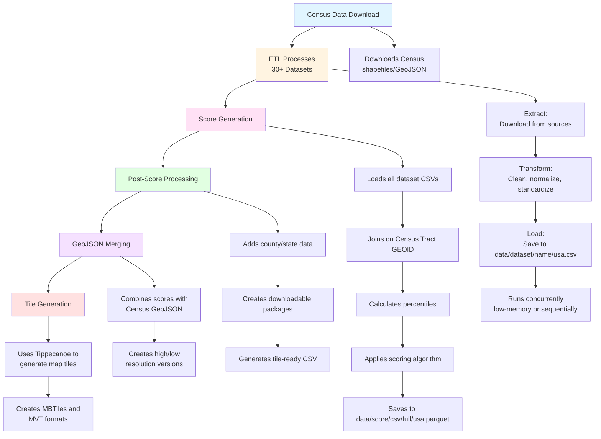

# Backend Python ETL Pipeline Analysis

## High-Level ETL Flow Overview

### 1. **Entry Point & CLI Interface**

- **Main Application** (`application.py`): Click-based CLI with commands for different pipeline stages
- **Key Commands**:
  - `census-data-download`: Downloads census geographic data
  - `etl-run`: Runs all or specific ETL processes
  - `score-run`: Generates the Justice40 score
  - `generate-score-post`: Post-processing (CSV generation, downloadable packages)
  - `geo-score`: Combines scores with GeoJSON
  - `generate-map-tiles`: Creates map tiles for visualization
  - `data-full-run`: Runs the entire pipeline end-to-end

### 2. **ETL Architecture**

#### **Base Class Pattern** (`base.py`)
- **`ExtractTransformLoad`** abstract base class that all ETL classes inherit from
- Standard lifecycle: `extract()` → `transform()` → `validate()` → `load()` → `cleanup()`
- Key features:
  - Data source caching mechanism
  - Geographic validation (tract/block group IDs)
  - Standardized output paths
  - YAML-based configuration support

#### **ETL Runner** (`runner.py`)
- Orchestrates ETL execution
- **Concurrency Management**:
  - Low-memory datasets run in parallel (ThreadPoolExecutor)
  - High-memory datasets run sequentially
  - Configurable via `is_memory_intensive` flag in constants
- **Dataset Discovery**: Dynamically loads ETL classes from `constants.py`

### 3. **Data Sources (30+ Datasets)**

Each dataset has its own ETL module in `etl/sources/`:

**Categories:**
- **Census Data**: Decennial census, ACS (American Community Survey), median income
- **Environmental**: EJSCREEN, EPA RSEI, FEMA National Risk Index, flood/wildfire risk
- **Health**: CDC Places, CDC Life Expectancy, CDC SVI
- **Housing**: HUD housing, historic redlining
- **Transportation**: DOT travel composite
- **Energy**: DOE energy burden
- **Geographic**: Tribal data, tribal overlap, abandoned mines, Army FUDS
- **State-Specific**: California, Michigan, Maryland EJScreen variants

**Example ETL Pattern:**
```python
class DatasetETL(ExtractTransformLoad):
    def get_data_sources(self) -> [DataSource]:
        # Define where to fetch data from
    
    def extract(self, use_cached_data_sources=False):
        # Download/retrieve data, optionally from cache
    
    def transform(self):
        # Clean, normalize, rename columns
        # Convert to standard format (Census Tract GEOID)
        # Set self.output_df
    
    def load(self):
        # Save to data/dataset/{name}/usa.csv
```

### 4. **Score Generation Process**

#### **ScoreETL** (`etl_score.py`)
1. **Extract Phase**:
   - Loads all processed datasets from `data/dataset/`
   - Reads ~20+ CSV files into pandas DataFrames

2. **Transform Phase**:
   - **Data Joining**: Merges all datasets on Census Tract GEOID (`GEOID10_TRACT`)
   - **Data Preparation**:
     - Calculates derived fields (e.g., median income as % of state/AMI)
     - Handles special cases (island areas, linguistic isolation, agricultural value)
   - **Percentile Calculation**: Computes percentile ranks for numeric indicators
   - **Score Calculation**: Uses `ScoreRunner` → `ScoreNarwhal` to compute final scores
   - **Island Demographics Backfill**: Special handling for island areas

3. **Load Phase**:
   - Saves final score as Parquet file: `data/score/csv/full/usa.parquet`

### 5. **Post-Score Processing**

#### **PostScoreETL** (`etl_score_post.py`)
- **County/State Merging**: Adds geographic context
- **Tile CSV Generation**: Creates simplified CSV for map tiles
- **Downloadable Package**: Generates ZIP with shapefiles and codebook
- **Data Formatting**: Rounds values, handles data types

#### **GeoScoreETL** (`etl_score_geo.py`)
- Merges score data with Census GeoJSON
- Creates two versions:
  - **High-resolution**: Full detail for zoomed-in views
  - **Low-resolution**: Simplified for zoomed-out views

### 6. **Tile Generation** (`tile/generate.py`)
- Uses **Tippecanoe** to generate map tiles
- Creates:
  - **MBTiles**: Single-file tile archives
  - **MVT (Mapbox Vector Tiles)**: Directory structure of tile files
- Separate tile sets for:
  - Score data (high/low zoom)
  - Tribal layer

### 7. **Data Flow Summary**



### 8. **Key Design Patterns**

- **Modular ETL Classes**: Each dataset is self-contained
- **Caching**: Data sources cached to avoid re-downloading
- **Validation**: Geographic and data quality checks at each stage
- **Configuration**: YAML-based configs for dataset definitions
- **Concurrency**: Smart parallelization based on memory requirements
- **Error Handling**: Validation at multiple stages

## Component Details

### ETL Base Class (`ExtractTransformLoad`)

The base class provides:
- Standardized directory structure (`DATA_PATH`, `TMP_PATH`, `SOURCES_PATH`)
- Common field names (`GEOID_FIELD_NAME`, `GEOID_TRACT_FIELD_NAME`)
- Abstract methods that must be implemented:
  - `get_data_sources()`: Returns list of data sources
  - `transform()`: Performs data transformation
- Built-in methods:
  - `extract()`: Handles downloading and caching
  - `validate()`: Validates geographic IDs and data quality
  - `load()`: Saves output to standardized location
  - `cleanup()`: Removes temporary files

### Dataset Configuration

Datasets are registered in `etl/constants.py` with:
- `name`: Unique identifier
- `module_dir`: Directory name in `etl/sources/`
- `class_name`: Python class name
- `is_memory_intensive`: Flag for execution strategy

### Score Calculation

The scoring process:
1. Loads all processed datasets
2. Joins on Census Tract GEOID (11-character identifier)
3. Calculates percentile ranks for each indicator
4. Applies scoring algorithm (via `ScoreNarwhal`)
5. Handles special cases (island areas, linguistic isolation, etc.)
6. Outputs final score with all indicators

#### **Prioritization Logic (ScoreNarwhal)**

The scoring algorithm determines which tracts are "prioritized" (disadvantaged communities) through a multi-step process:

**1. Factor-Based Evaluation (8 Categories)**
- Each tract is evaluated across 8 factor categories:
  - **Climate** (`N_CLIMATE`): Flood risk, wildfire risk, expected losses
  - **Energy** (`N_ENERGY`): Energy burden, PM2.5 exposure
  - **Transportation** (`N_TRANSPORTATION`): Diesel PM, traffic proximity, travel burden
  - **Housing** (`N_HOUSING`): Housing burden, lead paint, kitchen/plumbing, impervious surfaces
  - **Pollution** (`N_POLLUTION`): Superfund sites, hazardous waste, RMP sites, abandoned mines, FUDS
  - **Water** (`N_WATER`): Leaky underground storage tanks, wastewater
  - **Health** (`N_HEALTH`): Asthma, diabetes, heart disease, low life expectancy
  - **Workforce** (`N_WORKFORCE`): Unemployment, poverty, low median income, linguistic isolation, education

- Each factor is a boolean: `true` if the tract exceeds thresholds for **at least one indicator** in that category
- Factor methods (e.g., `_climate_factor()`, `_health_factor()`) check multiple indicators within each category

**2. SCORE_N_COMMUNITIES Calculation**
```python
SCORE_N_COMMUNITIES = any(N_CLIMATE, N_ENERGY, N_TRANSPORTATION, N_HOUSING, 
                          N_POLLUTION, N_WATER, N_HEALTH, N_WORKFORCE)
```
- A tract is a `SCORE_N_COMMUNITIES` if it has **at least one factor** that is `true`
- This means the tract exceeds thresholds for at least one indicator in at least one category

**3. Adjacency-Based Prioritization ("Donut Holes")**
- Tracts can also be prioritized via adjacency, even if they don't meet indicator thresholds themselves
- A "donut hole" tract is:
  - Surrounded by tracts that are `SCORE_N_COMMUNITIES`
  - Meets a less stringent low-income threshold (`LOW_INCOME_THRESHOLD_DONUT = 0.50`)
- Calculated as: `SCORE_N_COMMUNITIES_ADJACENT_MEAN` (based on average of neighboring tracts)

**4. FINAL_SCORE_N_BOOLEAN (SN_C) - Final Prioritization**
```python
FINAL_SCORE_N_BOOLEAN = SCORE_N_COMMUNITIES | SCORE_N_COMMUNITIES_ADJACENT_MEAN
```
- A tract is prioritized if:
  - It has indicators itself (direct prioritization), **OR**
  - It is adjacent to prioritized tracts (adjacency-based prioritization)
- This boolean becomes `SN_C` in the tile data and is used for map visualization

**5. Special Cases**
- **Grandfathered Tracts**: Tracts from v1.0 that remain prioritized (`SN_GRAND`)
- **Tribal DACs**: Tracts that are approximately 100% tribal land are automatically Score N communities
- **Territory DACs**: Special handling for island areas (Puerto Rico, Guam, etc.)

**6. Key Implications**
- **Not all prioritized tracts have indicators**: Adjacency-based prioritized tracts may have `TOTAL_NUMBER_OF_DISADVANTAGE_INDICATORS = 0`
- **Prioritization ≠ Indicator Count**: A tract can be prioritized with 0 indicators (via adjacency) or with many indicators
- **Frontend Mapping**: The `SCORE_PROPERTY_HIGH` (`SN_C`) boolean determines which tracts appear as "prioritized" on the map
- **Indicator Selection**: When filtering/coloring by specific indicators, adjacency-prioritized tracts (with 0 indicators) will not match unless "Identified as disadvantaged" is checked

### Output Structure

```
data/
├── census/              # Census geographic data
├── dataset/              # Processed datasets (one per source)
│   ├── ejscreen/
│   ├── census_acs/
│   └── ...
├── score/
│   ├── csv/
│   │   ├── full/        # Full score file
│   │   └── tiles/       # Simplified for tiles
│   ├── geojson/         # Score + geographic data
│   ├── tiles/           # Generated map tiles
│   └── downloadable/    # ZIP packages for download
└── sources/             # Cached source data
```

## Summary

This pipeline processes multiple environmental, demographic, and geographic datasets to produce the Justice40 score used by the CEJST (Climate and Economic Justice Screening Tool). The architecture is modular, allowing easy addition of new data sources while maintaining consistency and quality through standardized patterns and validation.

